## Welcome to DOTS News ##

**DOTS News** is a news aggregator built as a project, as part of COM212P, Database Systems Course, given by IIITDM Kancheepuram.

**[DOTS News](https://appl-web-news.000webhostapp.com)**

### Overview ###
DOTS News is a news aggregator created as part of coursework assigned as a part of the course Database Systems COM212P.  
#### Goals ####
- To create a simple news interface without high usage of bandwidth
- To address privacy concerns over data collection (DOTS collects a low amount of data compared to other existing products)
- To allow users to contribute to the project through their own content
- To bring together news from various platforms for convenience of the users

DOTS is aimed at general readers of news. It is also aimed at writers who want to showcase their content.

#### Team ####
- Vamsi Krishna Thigulla - Team Leader, Content Manager - coe18b056@iiitdm.ac.in
- Hrishikesh Rajesh Menon - Graphic Designer - coe18b024@iiitdm.ac.in
- Srinivasan R. Sharma - User Database Administrator, Backend Developer - coe18b065@iiitdm.ac.in
- Vijay Meena - Primary Front End Developer - ced18i057@iiitdm.ac.in
- Shashank Dokania - Content Validation, Spam Checking - coe18b067@iiitdm.ac.in

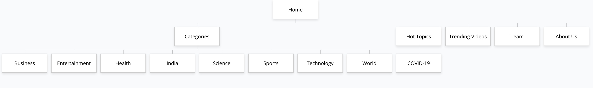

### Pages ###
#### Homepage ####
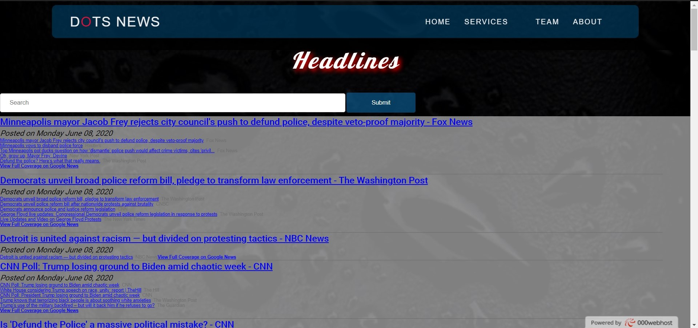

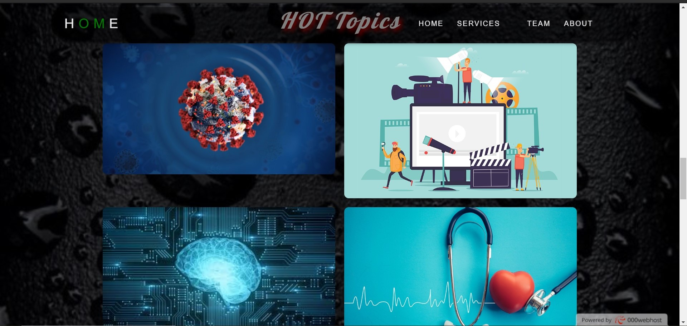

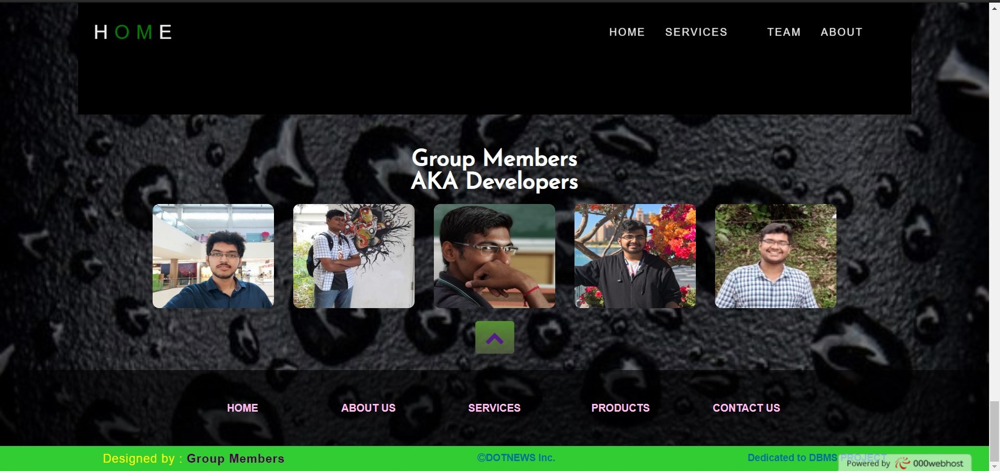

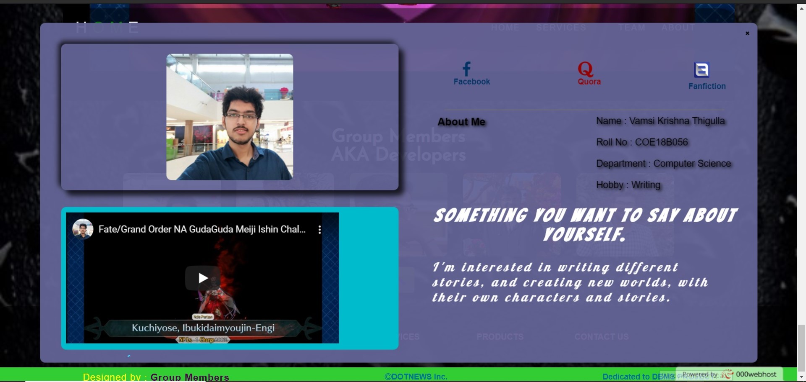

#### Business ####

#### Entertainment ####
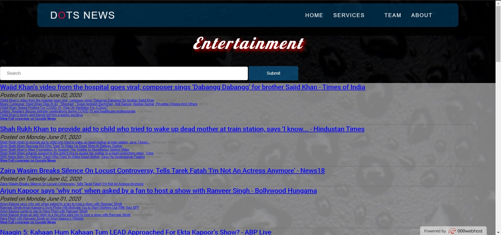

#### Health ####
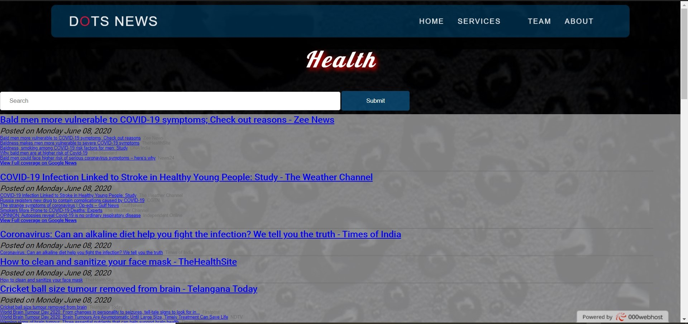

#### India ####
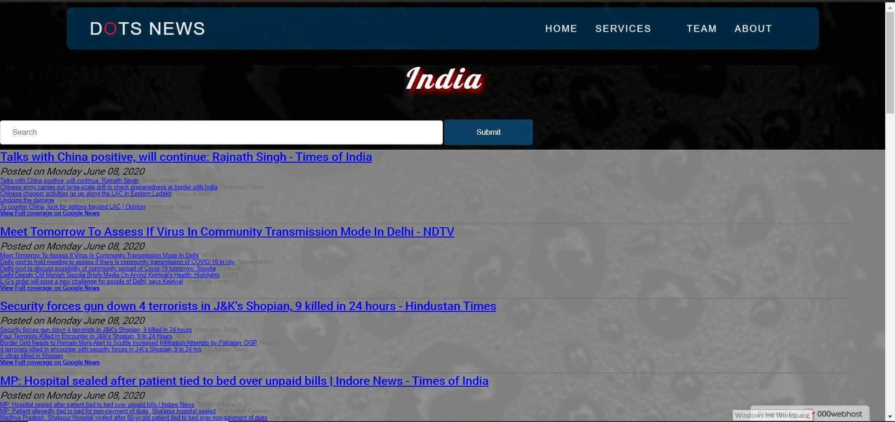

#### Science ####
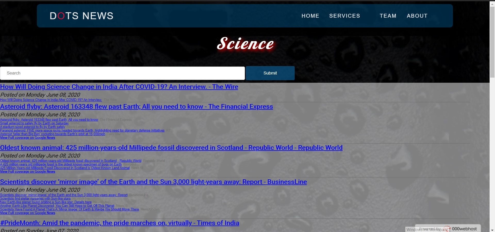

#### Sports ####
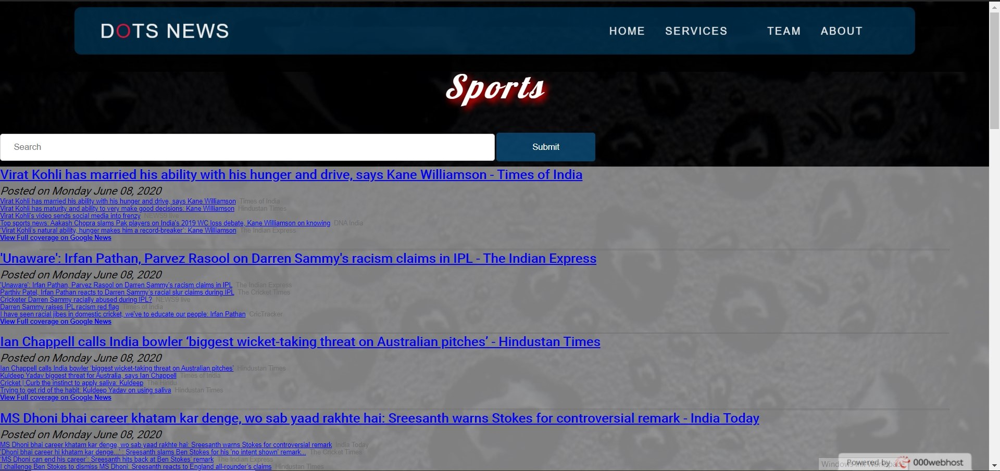

#### Technology ####
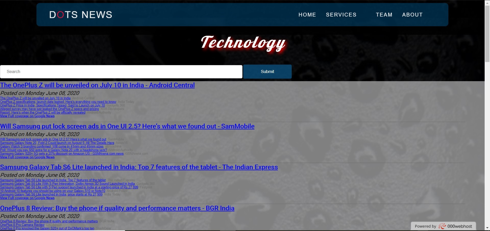

#### World ####
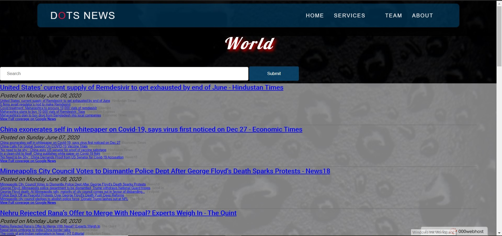

#### Hot Topics ####
##### COVID-19 #####
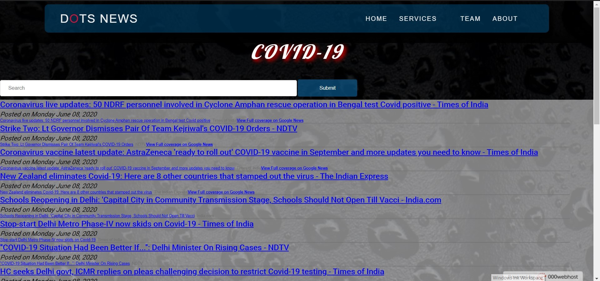

### Users ###
#### Signup steps ####
1. New users need to register to submit their stories to be selected for the Best Story.
2. Users need to enter their unique Username, Password, Email Address and Age. 
3. 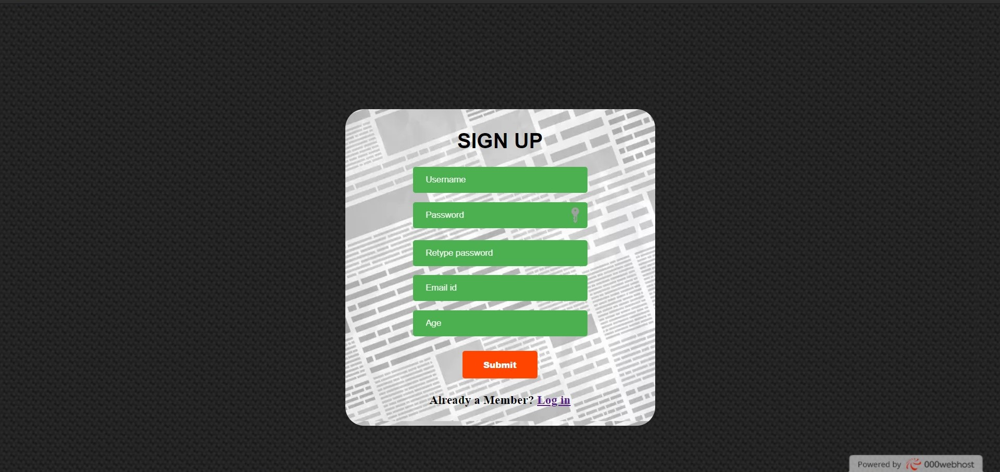
4. Once registered, an email address cannot be used to register again. 
5. 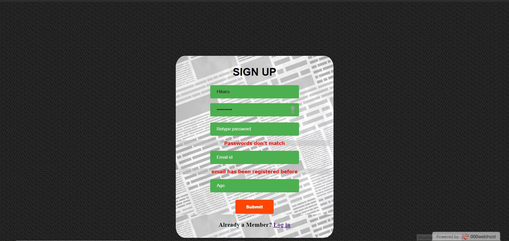
6. A verification key will be sent to the registered email after which, users may login. 
7. 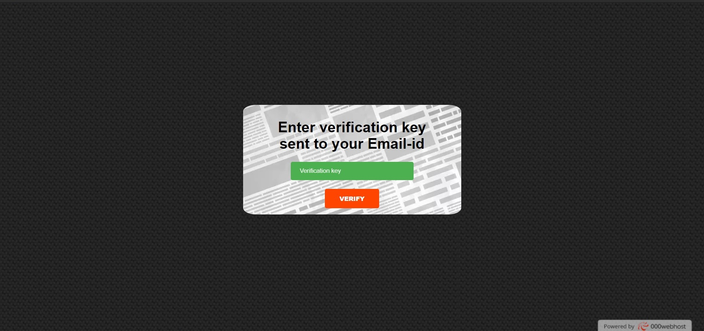

#### Login ####
1. Enter the Username and Password with which you have registered.
2. 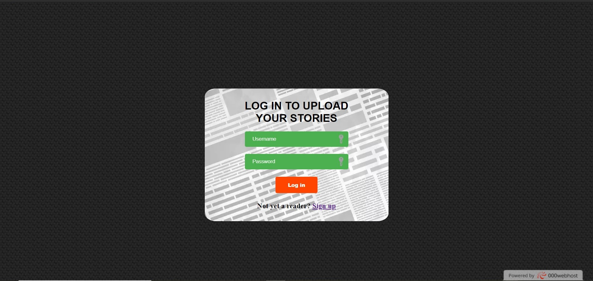
Note: If you are a newly registered user, please verify your account before logging in to your account.

#### Story Submission ####
1. Registered users can submit stories of any genre.
2. Stories will be considered for the Best Story of the month, and will be selected by the editor.
3. Guidelines to follow for story submission:
* All submissions must be in .txt format only.
* The author name and story title must be given at the beginning.
4. There is no limit to the number of submissions from a user.
5. 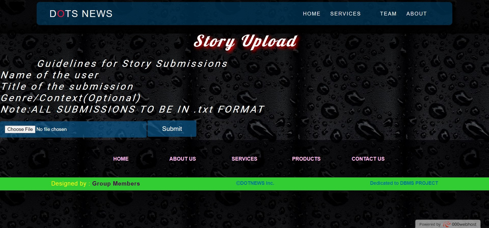
